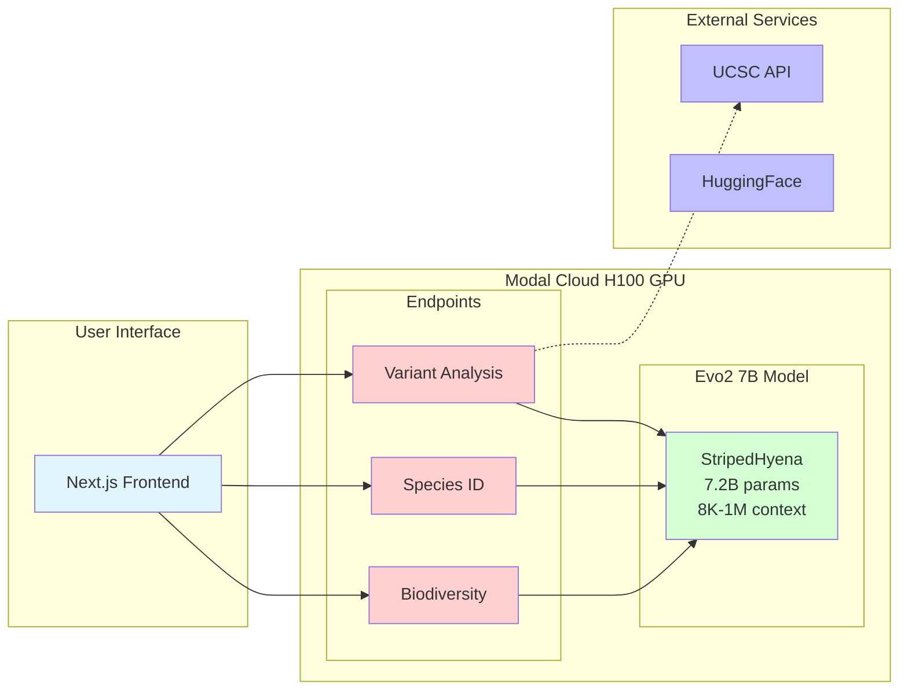
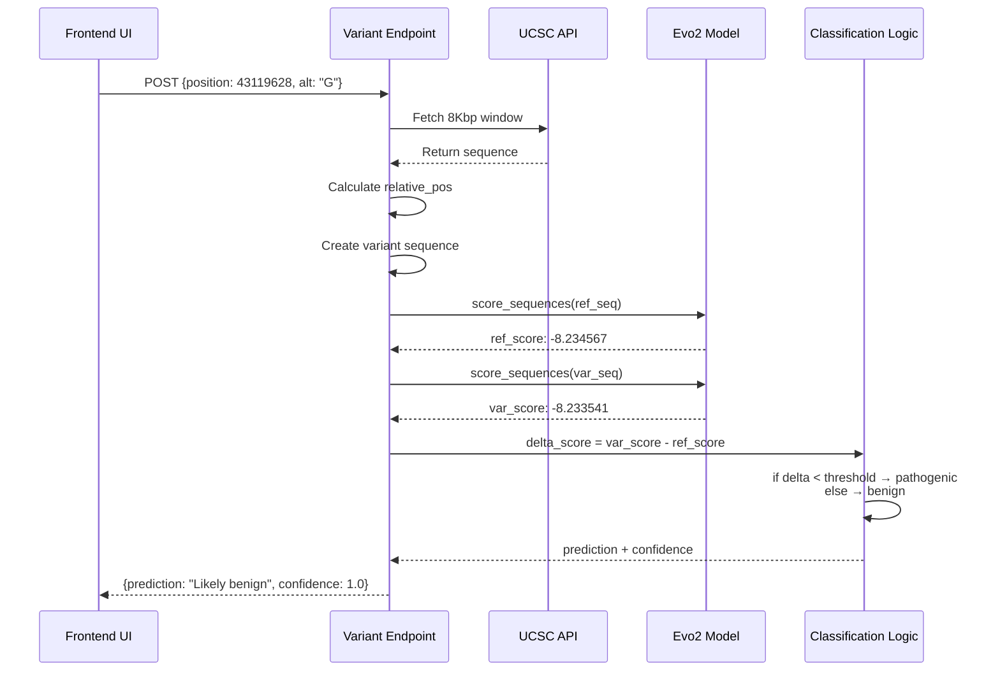
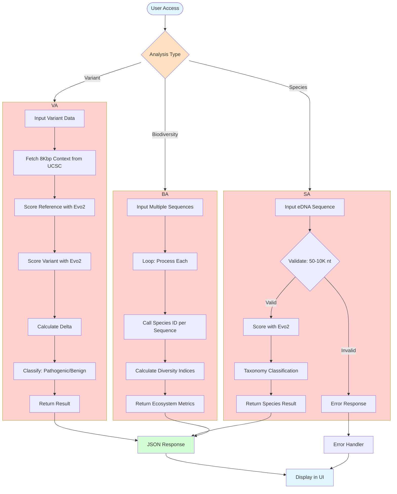
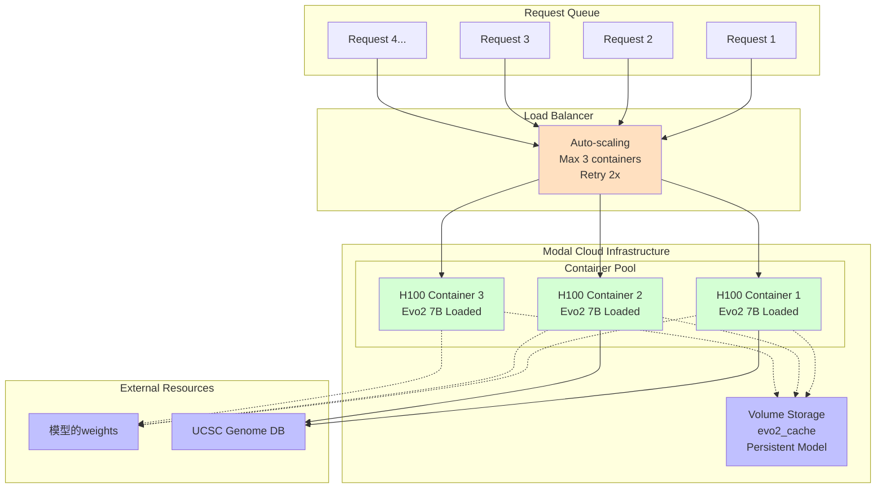
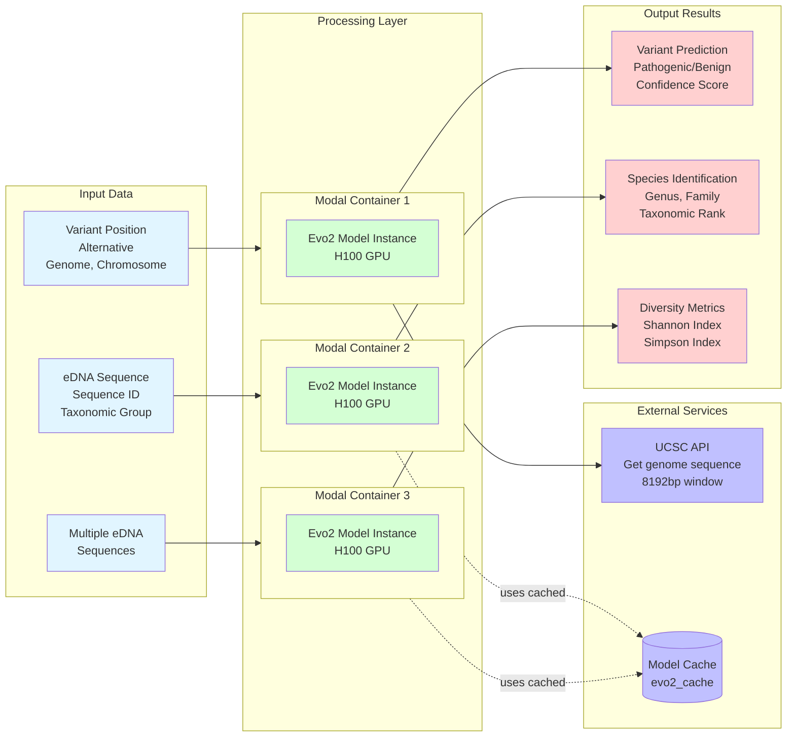
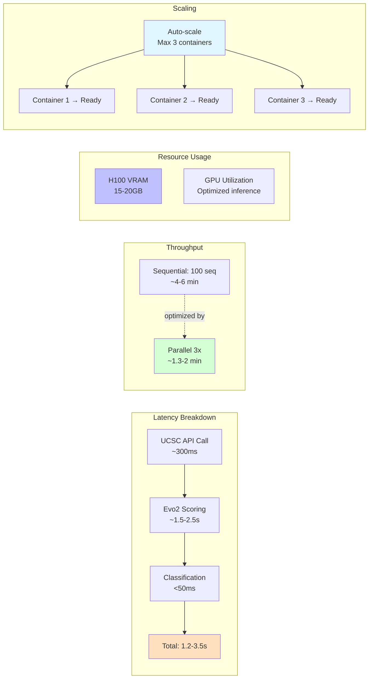

# Evo2 Genomic Analysis Pipeline - Mermaid Diagram

## Complete System Architecture Diagram

```mermaid
graph TB
    subgraph "Layer 1: Frontend Interface"
        FE1[Gene Browser Interface<br/>Interactive navigation<br/>Sequence display]
        FE2[Species ID Tab<br/>eDNA input form<br/>Taxonomic selection]
        FE3[Biodiversity Tab<br/>Bulk upload<br/>Ecosystem visualization]
    end

    subgraph "Layer 2: Modal Cloud Platform"
        subgraph "Container Config"
            CC[GPU: H100 80GB<br/>Max Containers: 3<br/>Retries: 2<br/>Scale-down: 120s<br/>CUDA 12.4.1]
        end
        
        subgraph "Evo2Model Class"
            VM[Volume: evo2_cache<br/>Mount: /evo2_cache]
            ME[@modal.enter<br/>load_evo2_model]
            
            subgraph "Evo2 Model Specs"
                ES[7.2B Parameters<br/>StripedHyena Architecture<br/>32 Layers<br/>Context: 8K-1M nt<br/>Hidden: 4096<br/>Vocab: 512]
            end
        end
        
        subgraph "API Endpoints"
            API1[analyze_single_variant<br/>POST]
            API2[identify_species<br/>POST]
            API3[analyze_biodiversity<br/>POST]
        end
    end

    subgraph "Pipeline 1: Variant Analysis"
        V1[Input: position, alt, genome, chr]
        V2[get_genome_sequence<br/>window_size=8192 bp]
        V3{UCSC API Call}
        V4[Calculate relative_pos<br/>Extract reference]
        V5[Create variant sequence]
        V6[Evo2: score ref sequence]
        V7[Evo2: score var sequence]
        V8[delta_score calculation]
        V9{Classification Logic<br/>threshold=-0.0009178519}
        V10[JSON Response<br/>prediction, confidence]
        
        V1 --> V2 --> V3 --> V4 --> V5 --> V6 --> V7 --> V8 --> V9 --> V10
    end

    subgraph "Pipeline 2: Species Identification"
        S1[eDNA Input<br/>sequence, id, group]
        S2{Validation<br/>50-10K nt}
        S3[Evo2: score sequence]
        S4[Mock taxonomy classification]
        S5[JSON Response<br/>species, genus, family]
        
        S1 --> S2 --> S3 --> S4 --> S5
    end

    subgraph "Pipeline 3: Biodiversity Analysis"
        B1[Multiple eDNA sequences]
        B2[Loop: identify_species per seq<br/>Max 3 containers parallel]
        B3[Aggregate taxonomy counts]
        B4[Calculate Shannon Index<br/>Calculate Simpson Index]
        B5[JSON Response<br/>diversity indices, abundance]
        
        B1 --> B2 --> B3 --> B4 --> B5
    end

    subgraph "Layer 4: External Services"
        HF[HuggingFace Hub<br/>arcinstitute/evo2_7b<br/>~14GB weights]
        UC[UCSC Genome Browser<br/>api.genome.ucsc.edu<br/>~300ms response]
        VOL[Modal Volume Storage<br/>Persistent caching]
    end

    FE1 --> API1
    FE2 --> API2
    FE3 --> API3
    
    API1 --> V1
    API2 --> S1
    API3 --> B1
    
    CC --> ME --> ES
    ME --> VM
    VM -.caches.-> VOL
    
    ME -.downloads.-> HF
    V3 --> UC
    
    V6 -.uses.-> ES
    V7 -.uses.-> ES
    S3 -.uses.-> ES
    
    style FE1 fill:#e1f5ff
    style FE2 fill:#e1f5ff
    style FE3 fill:#e1f5ff
    
    style CC fill:#f0d0ff
    style ME fill:#d4ffd4
    style ES fill:#d4ffd4
    
    style API1 fill:#ffd0d0
    style API2 fill:#ffd0d0
    style API3 fill:#ffd0d0
    
    style V9 fill:#ffe0c0
    style S2 fill:#ffe0c0
    
    style HF fill:#c0c0ff
    style UC fill:#c0c0ff
    style VOL fill:#c0c0ff
```

---

## Alternative: Simplified Overview Diagram



---

## Detailed Variant Analysis Flow



---

## Complete System Flow



---

## Infrastructure Architecture



---

## Data Flow Diagram



---

## Decision Tree for Classification

```mermaid
graph TD
    Input[Delta Score from Evo2] --> Check{delta_score < threshold<br/>-0.0009178519?}
    
    Check -->|Yes| Pathogenic[Likely Pathogenic]
    Check -->|No| Benign[Likely Benign]
    
    Pathogenic --> P_Conf[Confidence =<br/>abs(delta - threshold) /<br/>lof_std 0.0015140239]
    
    Benign --> B_Conf[Confidence =<br/>abs(delta - threshold) /<br/>func_std 0.0009016589]
    
    P_Conf --> Cap1{Capped at 1.0}
    B_Conf --> Cap2{Capped at 1.0}
    
    Cap1 --> P_Final[Final Prediction<br/>Pathogenic + Confidence]
    Cap2 --> B_Final[Final Prediction<br/>Benign + Confidence]
    
    P_Final --> Output[JSON Response]
    B_Final --> Output
    
    style Input fill:#e1f5ff
    style Check fill:#ffe0c0
    style Pathogenic fill:#ff8888
    style Benign fill:#88ff88
    style P_Final fill:#ffd0d0
    style B_Final fill:#ffd0d0
    style Output fill:#d4ffd4
```

---

## Performance Metrics Flow



---

## Use the Mermaid Live Editor

1. Go to: https://mermaid.live
2. Paste any of the diagram codes above
3. Customize colors, labels, or layout as needed
4. Export as PNG, SVG, or shareable link

### Recommended diagrams for your paper:
- **Complete System Architecture**: Full overview
- **Detailed Variant Analysis Flow**: In-depth pipeline
- **Infrastructure Architecture**: Deployment and scaling
- **Decision Tree**: Classification logic

Choose the diagram(s) that best fit your paper's needs!
